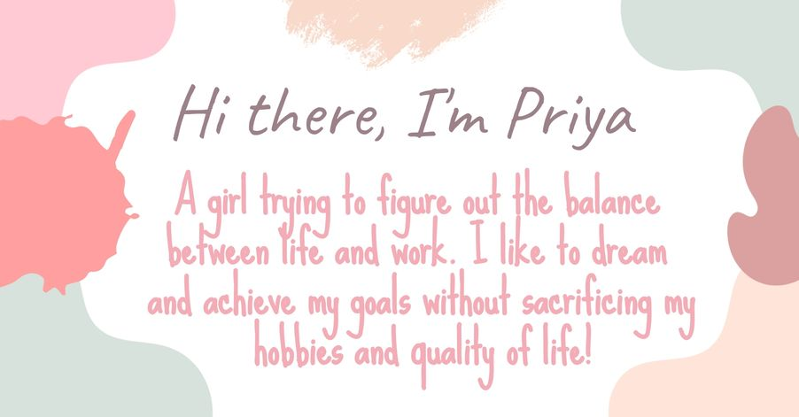

  

## 
 Hola, Welcome to my GitHub  

### I'm a girl with Dreams, Passion, and Creativity!! I'm a Passionate Developer, Blogger, and a Radio Host!!

  

- 🔭 I’m currently working on Web application projects using Front-End technologies such as React and Angular JS.
- 📫 How to reach me - 
- ⚡ Fun fact - I love to convert a random thing into a piece of art
- 🌱 I’m currently learning more about User Experience and Design.
- 👯 I’m looking for pair learning about designs and editing.
- 🤔 Trying to improve productivity and managing time.
- 😄 Pronouns: She/Her

<h3 align="left">Connect with me:</h3>

  
  
  
  
  
  
  
  
  

<h3 align="left">Programming Languages:</h3>

   
  
  
  
  

<h3 align="left">Web Technologies:</h3>

  
  
  
  
  
  
  
    

<h3 align="left">Quality Assurance and Tools:</h3>

  
  
  
  
  
   
  
  
  

  

  

### Show some ❤️ by starring some of the repositories!

